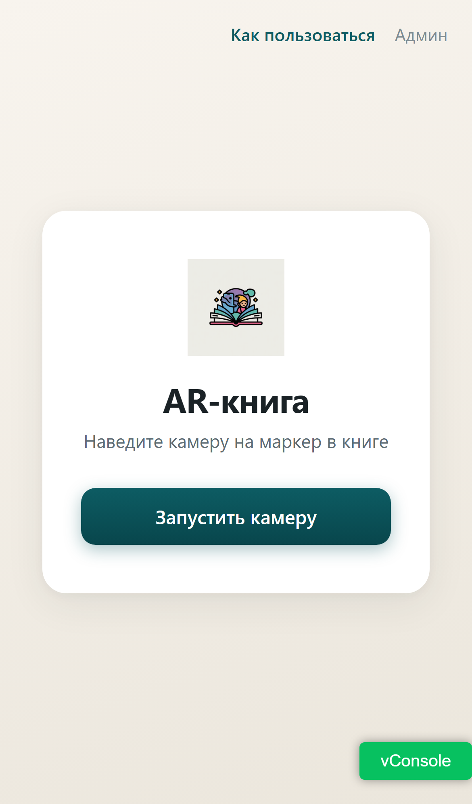
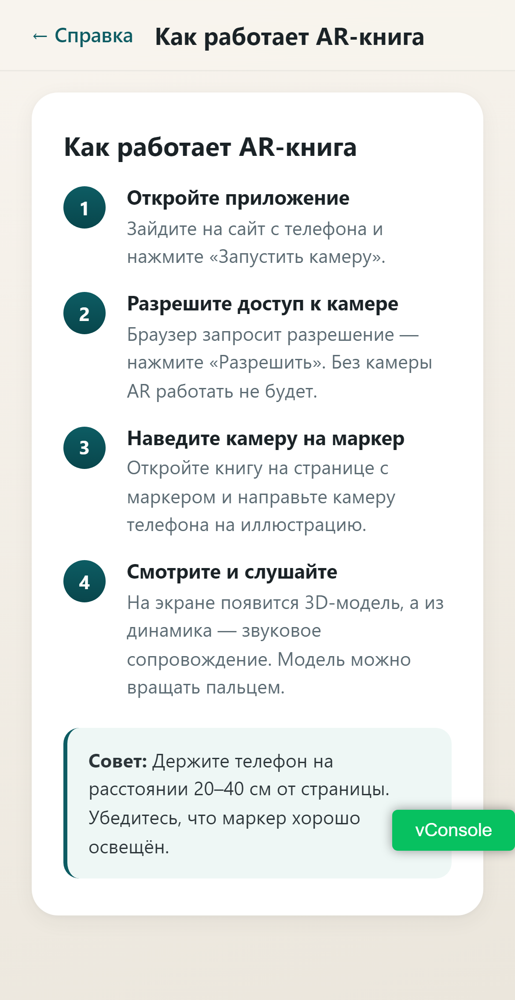
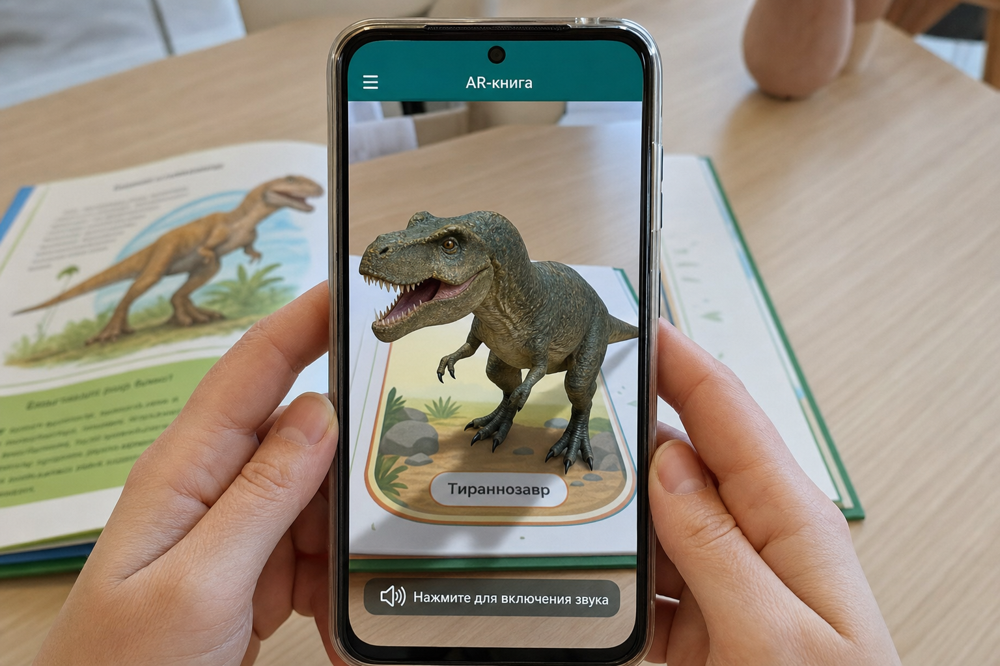
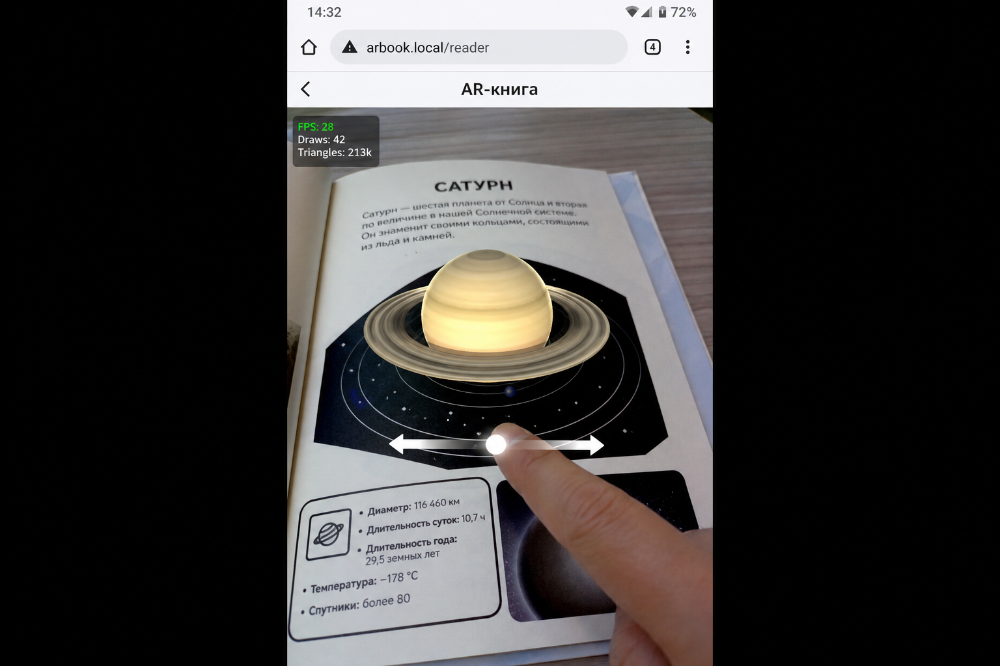

# Экспериментальная проверка AR-функциональности ARBook

Материал подготовлен для раздела «Отзыв руководителя»: демонстрация того, что дополненная реальность в системе **реализована и работает** на типичных сценариях использования.

**Техническая основа:** WebAR в браузере (MindAR — image target tracking, Three.js — рендер GLB-моделей, HTMLAudioElement — звук). Пользователь открывает PWA на телефоне, запускает камеру и наводит её на **печатный маркер** на странице книги.

---

## Сценарий 1. Учащийся изучает тему по печатной книге с AR-иллюстрацией

### Задача пользователя (проблема)

Ученик читает учебник по биологии (раздел «Динозавры»). На странице — плоская иллюстрация и текст. Статичное изображение не передаёт объём, пропорции и «оживлённость» объекта; сложно удержать внимание и связать картинку с реальным видом животного.

### Решение в ARBook

1. Ученик открывает сайт ARBook на смартфоне и нажимает **«Запустить камеру»**.
2. Браузер запрашивает доступ к камере; после разрешения приложение загружает маркеры и объединённый файл `.mind` с сервера.
3. Камера наводится на страницу книги с **маркером-иллюстрацией**.
4. MindAR распознаёт маркер, создаёт якорь; Three.js отображает **3D-модель тираннозавра**, привязанную к плоскости страницы.
5. При обнаружении маркера воспроизводится **звуковое сопровождение**; пользователь может **вращать модель** жестом.

### Скриншоты эксперимента

**Рис. 1.** Стартовый экран приложения — точка входа в AR-сессию.

**Рис. 2.** Инструкция «Как работает AR-книга» (4 шага для пользователя).

**Рис. 3.** Эксперимент: камера распознала маркер на странице книги «Динозавры», на экране отображается 3D-модель **«Тираннозавр»**, видна подсказка включения звука. Модель устойчиво следует за маркером при движении телефона.

**Вывод по сценарию 1:** AR-сессия успешно запускается; image target tracking работает; GLB-модель рендерится поверх реальной страницы; интерфейс предусматривает аудио и интерактив.

---

## Сценарий 2. Интерактивное изучение темы «Солнечная система» (вращение модели)

### Задача пользователя (проблема)

При изучении астрономии ученику трудно представить форму планеты и её положение относительно колец **Сатурна** по одной только плоской картинке в книге. Нужен наглядный, интерактивный 3D-объект, который можно рассмотреть с разных сторон, не выходя из учебного процесса.

### Решение в ARBook

1. Открыта страница книги с маркером на тему «Сатурн».
2. После распознавания маркера на экране появляется **3D-модель планеты с кольцами**.
3. Пользователь **вращает модель** горизонтальным свайпом (модуль `useModelRotation.ts`).
4. В режиме разработки отображается панель производительности (FPS, draw calls) — подтверждение стабильной работы сцены на мобильном устройстве.

### Скриншот эксперимента

**Рис. 4.** Эксперимент: маркер на странице «САТУРН» отслеживается; 3D-модель планеты наложена на реальную страницу; пользователь взаимодействует с моделью (жест вращения). FPS ≈ 28 — приемлемо для WebAR на телефоне.

**Вывод по сценарию 2:** Помимо трекинга, реализовано **пользовательское вращение** модели по оси Y; сцена обновляется в реальном времени при движении камеры и жестах.

---

## Дополнительно: подготовка AR-контента (администратор)

Типичный сценарий автора учебника: загрузить `.mind`-файл маркера, GLB-модель и аудио через админ-панель, чтобы читатели могли использовать AR на соответствующих страницах.

**Рис. 5.** Экран входа в админ-панель (`/login`) — управление маркерами доступно после авторизации.

---

## Общий вывод для отзыва руководителя

| Критерий | Результат эксперimentа |
|----------|------------------------|
| Наличие AR | Да — marker-based WebAR (MindAR + Three.js) |
| Распознавание маркера | Да — модель привязана к печатной иллюстрации |
| 3D-контент | Да — загрузка и отображение GLB |
| Звук | Да — синхронизация с обнаружением маркера |
| Интерактив | Да — вращение модели жестом |
| Доступность | Да — браузер/PWA на смартфоне, без установки из магазина |

Разработанное приложение **ARBook** решает задачу «оживления» печатной книги: пользователь наводит камеру на маркер и получает синхронизированные 3D-модель и звук. Эксперименты подтверждают работоспособность ключевых компонентов AR-подсистемы.
