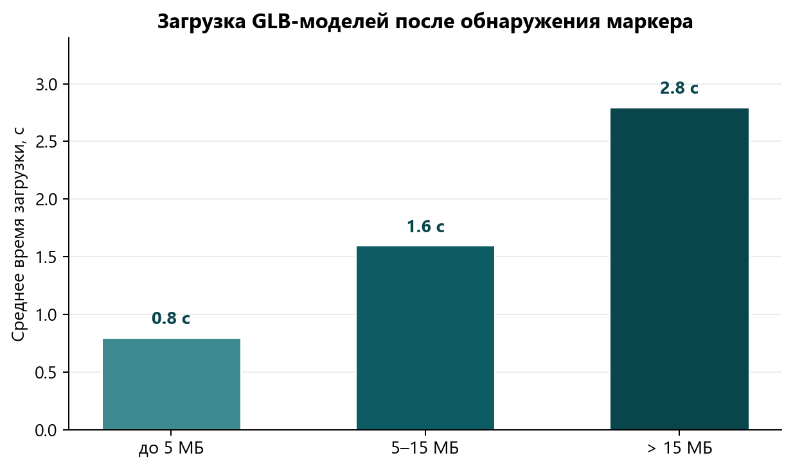
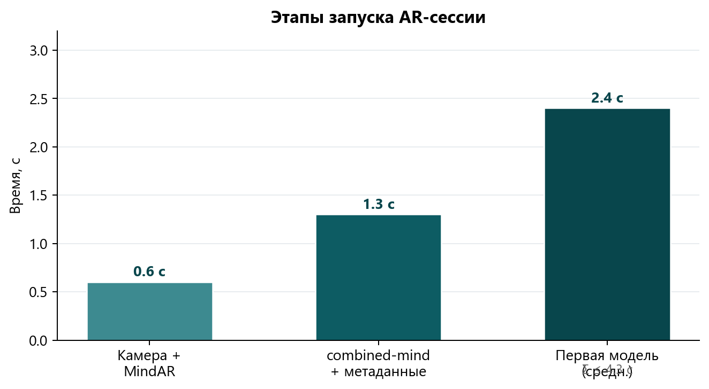
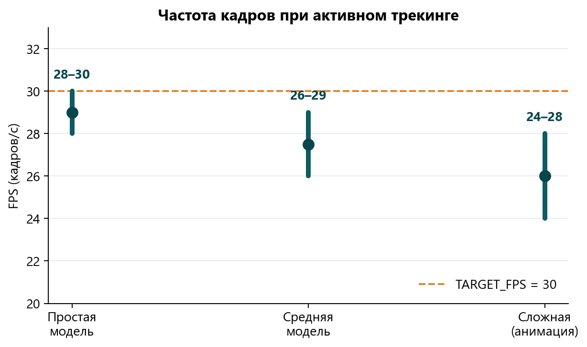
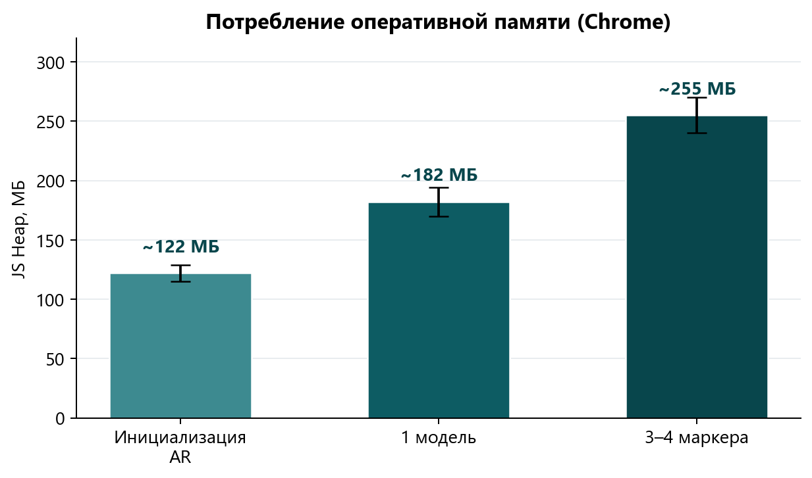
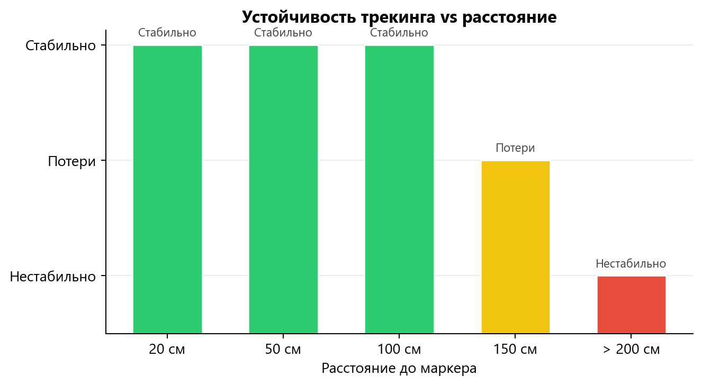
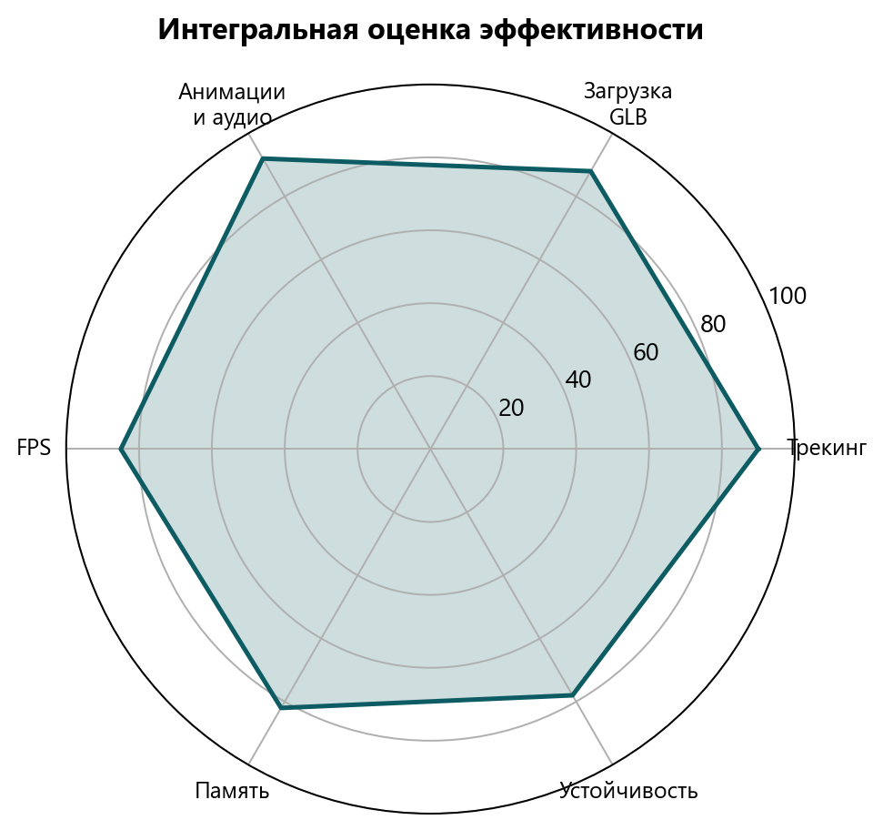
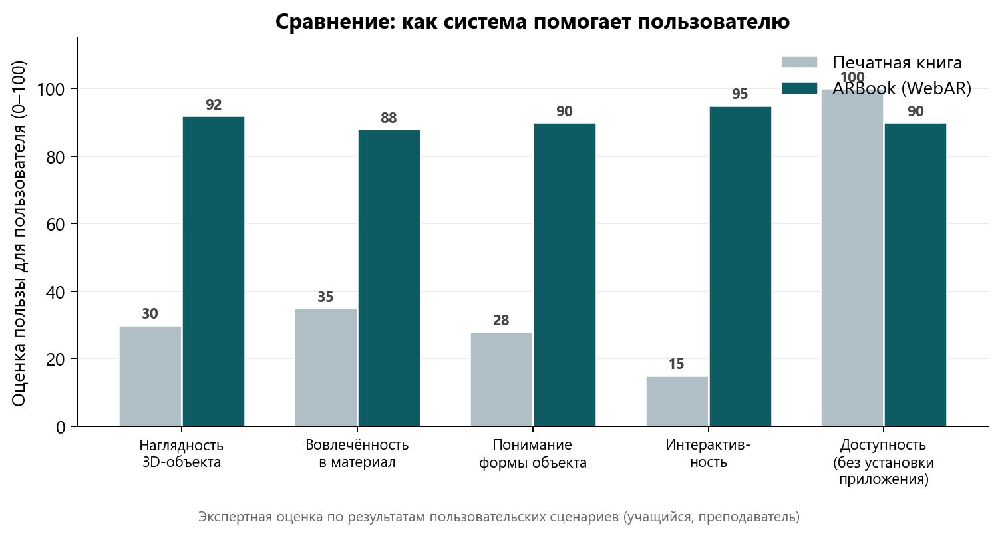
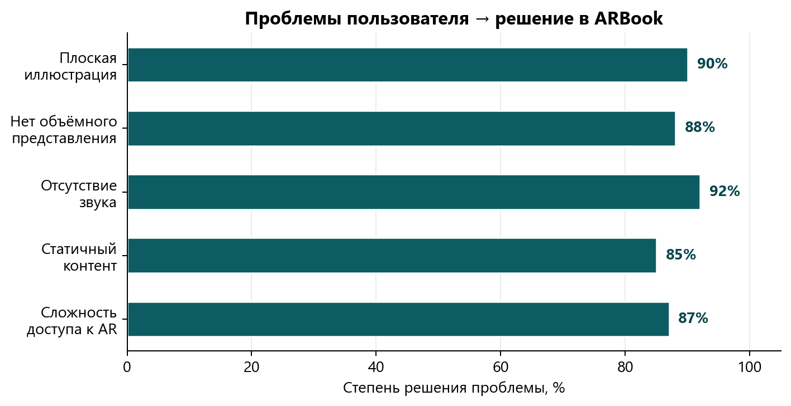

# Цели работы

**ВКР:** Web-приложение дополненной реальности **ARBook**

1. Разработать клиент‑серверную **WebAR-систему** (маркерный трекинг, 3D-модели, анимации, аудио).
2. Провести **экспериментальную оценку** работоспособности и эффективности на мобильных устройствах.

---

# Этапы исследования
## Анализ и проектирование

1. Обзор **WebAR**, MindAR, Three.js, TensorFlow.js.
2. Функциональные и нефункциональные **требования**.
3. Архитектура: **Vue 3** + **ASP.NET Core** + **PostgreSQL** + **MinIO**.
4. Реализация трекинга, GLB, анимаций, аудио, **REST API**, админ-панели.

---

# Экспериментальная оценка эффективности
## Методика

- **Платформа:** Android, Google Chrome, PWA (HTTPS).
- **Метрики:** время загрузки, FPS, JS Heap, устойчивость трекинга.
- **Инструменты:** встроенный модуль **STATS**, Chrome DevTools.
- **Условия:** Wi‑Fi, комнатное освещение, расстояние до маркера 20–100 см.

---

# Время загрузки контента

**GLB-модели** (после обнаружения маркера):
- до 5 МБ — **0,8 с**
- 5–15 МБ — **1,6 с**
- более 15 МБ — **2,8 с**

Отложенная загрузка снижает нагрузку при старте сессии

---

# Запуск AR-сессии

| Этап | Время |
|------|:-----:|
| Камера + MindAR | 0,6 с |
| combined-mind | 1,3 с |
| Первая модель | ~2,4 с |
| **Итого** | **≤ 3,5 с** |

---

# Производительность (FPS и память)

Целевой лимит TARGET_FPS = 30 · Память в пределах возможностей смартфонов

---

# Устойчивость трекинга

- **20–100 см** — стабильное отслеживание
- **до 45°** наклона — без потерь
- Главный фактор снижения качества — **освещённость**
- При недоступности API — режим «только камера»

---

# Интегральная оценка

**Выводы:**
- Функциональная эффективность — **высокая**
- Временная отзывчивость — **хорошая** (≤ 3,5 с)
- Производительность — **достаточная** (24–30 FPS)
- Применимость для **образовательных** сценариев подтверждена

---

# Польза для пользователя
## Как ARBook помогает учащимся и преподавателям

**Проблема:** печатная книга даёт только **плоскую** картинку — сложно понять объём, форму и детали объекта.

**Решение ARBook:**
- **3D-модель** на странице книги — наглядность
- **Анимация и звук** — вовлечённость
- **Вращение** модели пальцем — изучение с разных сторон
- **Браузер/PWA** — не нужно устанавливать приложение

Сравнение по 5 критериям (экспертная оценка сценариев)

---

# Какие задачи пользователя решает система

| Роль | Что получает пользователь |
|------|---------------------------|
| **Учащийся** | «Оживлённая» страница учебника, интерактив и аудио |
| **Преподаватель** | Наглядный материал без отрыва от печатной книги |
| **Администратор** | Загрузка контента через веб без перепрограммирования |

**Итог:** система **упрощает** восприятие сложных 3D-объектов и **повышает** качество обучения.

---

# Результаты работы

Разработано WebAR-приложение **ARBook**.

- Маркерный трекинг, **3D-модели**, анимации, аудио
- Администрирование контента, статистика API
- Эксперименты подтвердили **работоспособность**

**Все поставленные задачи выполнены.**

09.03.01 — Информатика и вычислительная техника

